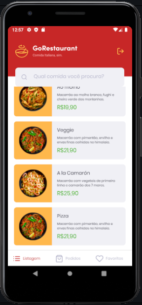

# Desafio Go Restaurant Mobile

- Nesse Desafio de módulo implementamos dentro de uma aplicação de restaurante em React Native chamadas a API que permitiram:
 - a listagem das comidas cadastradas na página dahsboard;
 - página de pedidos já realizados;
 - página de comidas favoritas;
 - página de detalhes do pedido onde são selecionados condimentos extras para o pedido e quantidade;

